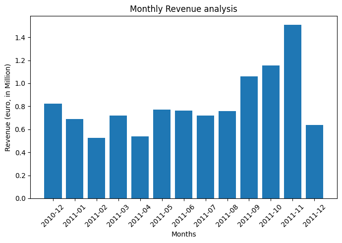
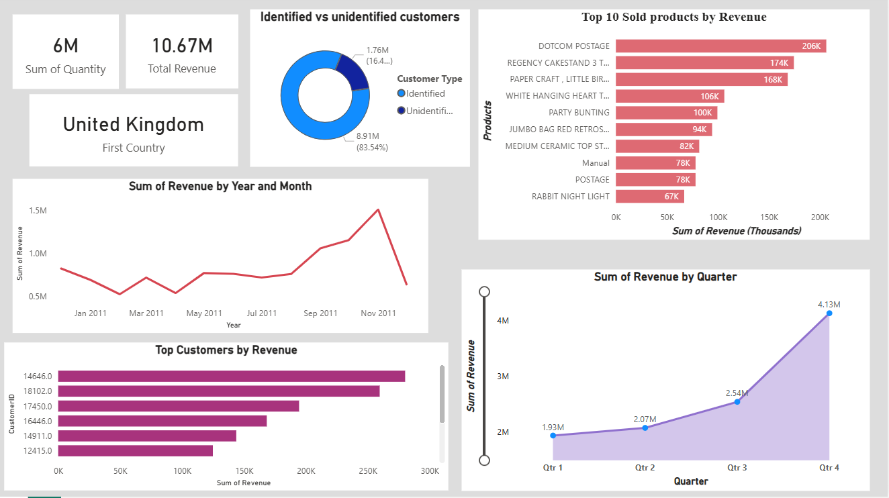

# E-Commerce Sales Analysis

This project analyzes e-commerce sales data to uncover trends, customer behavior, and key business insights.

Tools used:
- Python (Pandas, NumPy)
- Power BI
- GitHub

## Project Objective

The goal of this project is to analyze e-commerce transaction data to identify:
- Sales trends over time
- Top-performing products
- Customer purchasing behavior
- Revenue patterns and return impact

## Dataset Information

The original dataset contains transaction-level e-commerce sales data including:
- Invoice number
- Product description
- Quantity
- Unit price
- Customer ID
- Country
- Invoice date

Note: Raw datasets are excluded from this repository due to size limitations.

## Project Structure

Ecom-data-analysis/
│── data/
|    └── online_retail.csv    # Raw data
├── notebooks/
│   └── Analysis.ipynb        # Data cleaning, EDA, visualizations
│
├── images/                   # Exported charts 
│
├── README.md
└── .gitignore

## Key insights
- UK contributes highest of transactions.
- Seasonal spikes in quarter 4
- Most revenue generated from a small percentage of products

### few charts from analysis

## power BI insights

#### Dataset not included due to size.
Please download the Online Retail dataset from Kaggle and place it inside the data/ folder.